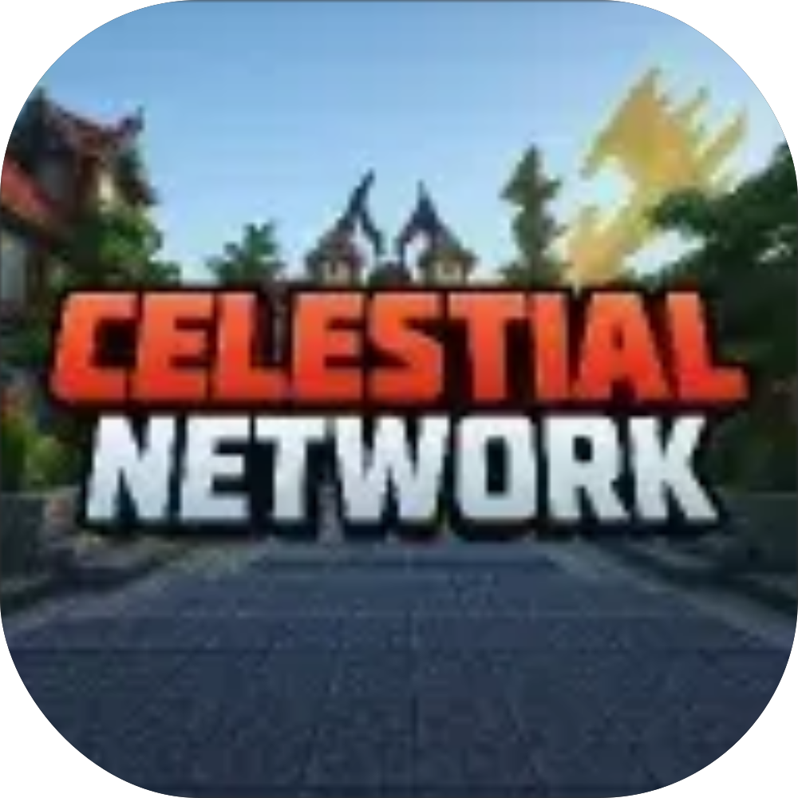
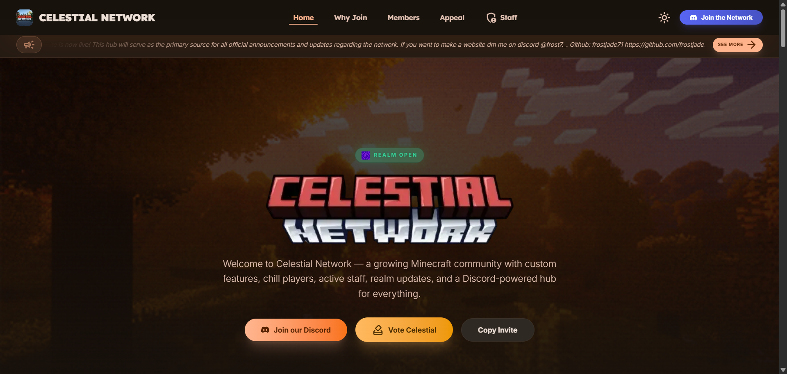

# 
# Celestial Network

A Minecraft landing page and management portal for the Celestial Network, featuring real-time status tracking, integrated community tools, and a comprehensive administrative dashboard. Built for minecraft community engagements.

 

## Key Features

- **Admin Dashboard**: Centralized management portal for controlling server status, news, and staff.
    - Real-time status toggle & sync across platform.
    - Secure Firebase-backed authentication.
    - Centralized system-wide configuration.
- **News & Announcements**: Integrated content management system for developmental updates.
    - Direct CRUD news feed management.
    - Automated front-page synchronization.
    - Clean, truncated content previews.
- **Live Realm Status**: Dynamic monitoring of server availability and community activity.
    - Real-time server health & maintenance tracking.
    - Live community pulse visualizations.
    - Zero-latency Firestore data synchronization.
- **Staff Management**: Secure personnel directory with simplified credential management.
    - Automated personnel registry and roles.
    - Secure email & password reset management.
    - Simplified staff onboarding and records.
- **Community Integration**: Deep Discord synchronization for player and voice activity.
    - Live member counts and voice channel stats.
    - Synced community resources and guides.
    - Real-time community engagement highlights.
- **Universal Accessibility**: Fully responsive architecture optimized for all device types.
    - High-performance React 19 & Vite 8 core.
    - Fully mobile-responsive and adaptive layouts.
    - Modern semantic and performant architecture.

## Technology Stack

  
  
  
  
  
  
  
  

- **Frontend Core**: React 19, Vite 8, TypeScript
- **Styling**: Tailwind CSS 4 (Material Design 3 & Stitch inspired)
- **Animations**: Framer Motion
- **Analytics**: Vercel Analytics
- **Icons**: Lucide React & Material Symbols
- **Notifications**: Sonner
- **Deployment**: Vercel

## Contributing

Contributions are welcome! Please see [CONTRIBUTING.md](CONTRIBUTING.md) for guidelines on reporting bugs, suggesting features, and submitting pull requests.

## ©️License

This project is licensed under the [MIT License](LICENSE).

Copyright (c) 2026 Jaderby Peñaranda.
